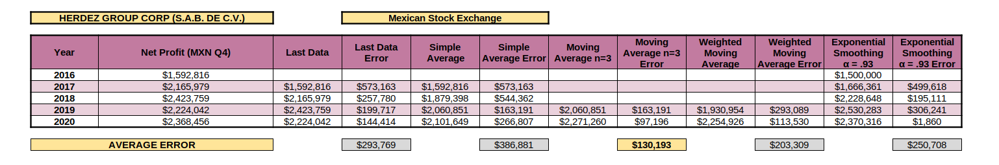
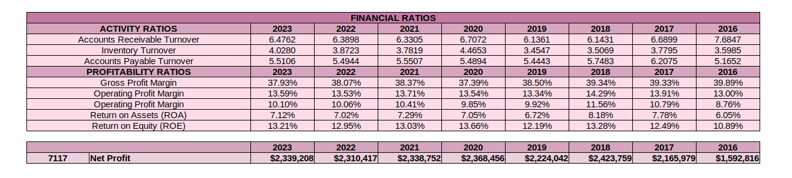
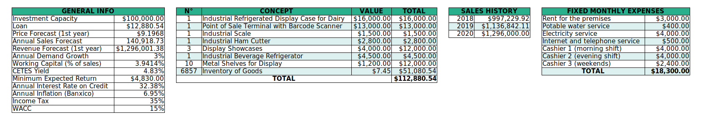
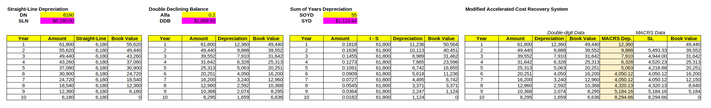
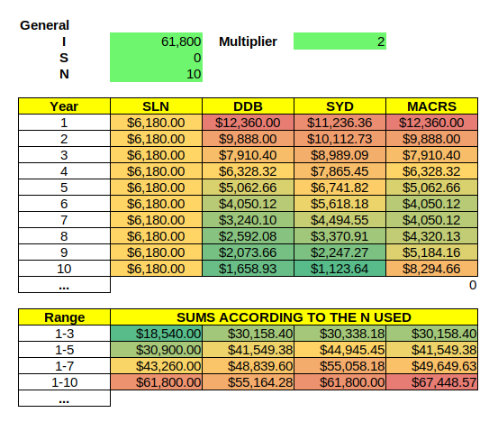
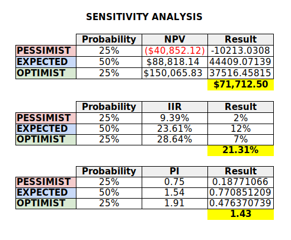

# OpenFinancialData

> "Information is the oil of the 21st century, and analytics is the combustion engine."  
> — Peter Sondergaard (Gartner IT Symposium/Xpo, October 2011).

The intelligent collection, cleaning, processing and visualization of data is an indispensable process for the efficient, precise, productive and sharp **self-criticism** of any project. 

This project seeks to facilitate the **accounting records** and **financial analysis** of companies, which includes the generation of **financial statements and their forecasts** based on different models, such as simple average, moving average, exponential smoothing, and so on. A mechanism will be developed to **analyze and visualize the evolution of companies** listed on the Securities and Exchange Commission (SEC) and Mexican Stock Exchange (BMV) using their public financial statements with a conversion from XBRL format to an R dataframe.

## Background
This project started as a personal initiative during my university career at Tecnológico de Monterrey (ITESM), who has agreements with several companies to facilitate students the development of projects attacking the specific problems they have (in this case **Herdez Group** with public data and **L'Oréal Paris Mexico** with private data).

## Current Development
These processes will be systematized to analyze on a large scale the evolution of the financial information provided by public companies listed in the SEC (US, through the official [EDGAR package](https://www.sec.gov/edgar/sec-api-documentation) in R) and BMV/BIVA (Mexico, initially through the API of the [DataBursatil](https://databursatil.com/docs.html) project).

### 1. General forecast and financial ratios
Obtain the net profit for Q4 of each year and apply different forecasting methods such as **Simple Average**, **Moving Average** (n = 3 and more), **Weighted Moving Avarage**, **Exponential Smoothing** (using different alphas), etc., calculating their respective **Median Absolute Deviation (MAD)** and highlighting the one with the highest accuracy.

Apply the most accurate forecasting method to the **Income Statement** with predictability up to 2 years.

Apply the most accurate forecasting method to the **Balance Sheet** with predictability up to 2 years.

Calculate current and forecasted **Financial Ratios**, such as the **Activity** (Accounts Receivable Turnover, Inventory Turnover and Accounts Payable Turnover) and **Profitability** (Gross Profit Margin, Operating Profit Margin, Operating Profit Margin, Return on Assets and Return on Equity) ratios allowing their data visualization.

### Investments and depreciations

Clarify the elements necessary to analyze potential investments, such as Investment Capacity, Loan, Price Forecast (1st year), Annual Sales Forecast, Revenue Forecast (1st year), Annual Demand Growth, Working Capital (% of sales), current Treasury Bills (US) or CETES (Mexico) yield, Minimum Expected Return, Annual Interest Rate on Credit, Annual Inflation, Income Tax, sales history and fixed monthly expenses.

> [!NOTE]
> Highlights information that users should take into account, even when skimming.

## Future work

- Local UX/UI.

## Contact

Feel free to reach out if you have any questions or feedback.

- **Email:** victorbenitogr@gmail.com
- **The subject must start with:**  [OpenFinancialData]