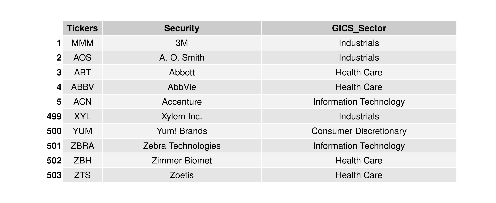
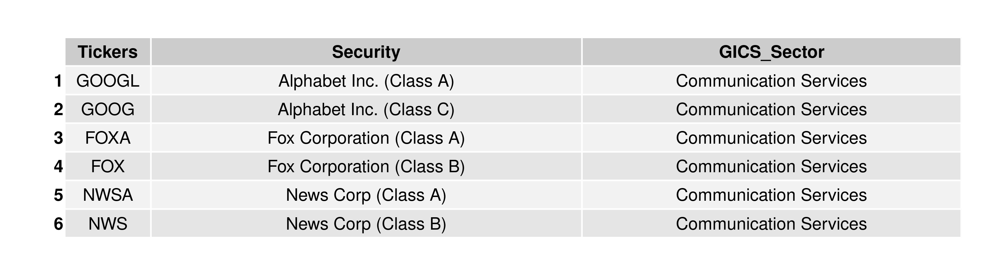
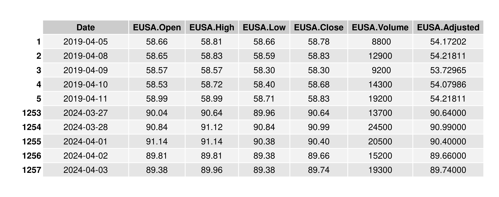
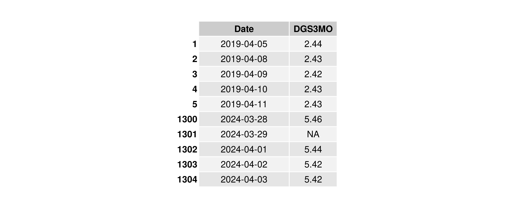
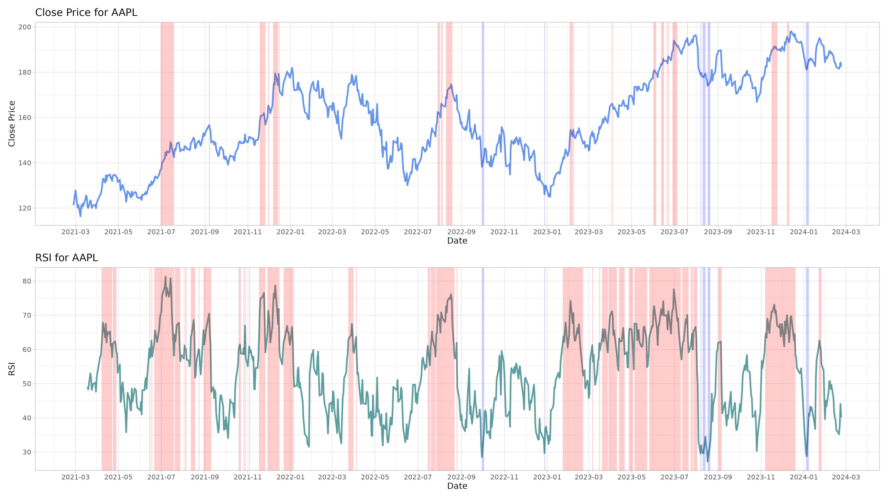
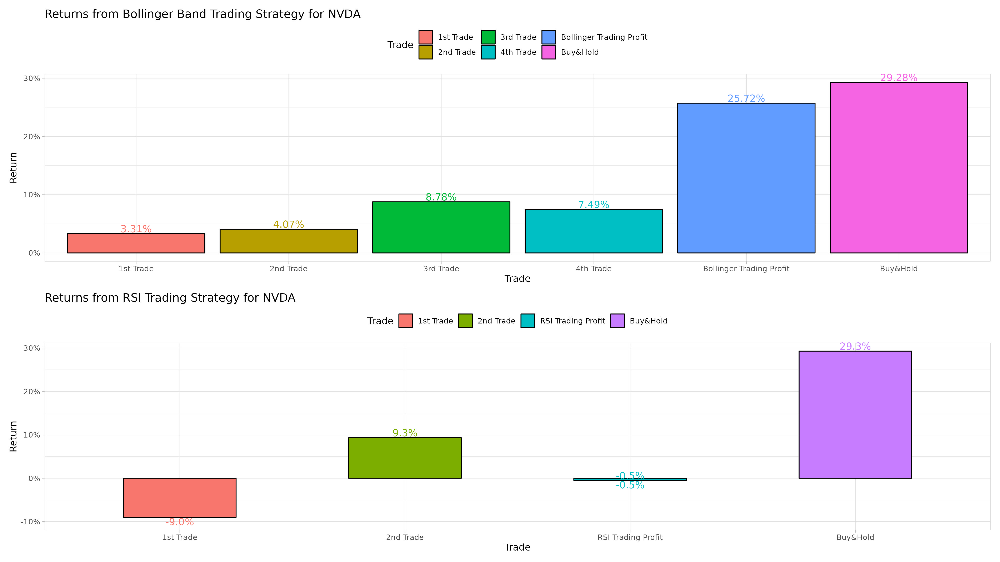

# OpenFinancialData
Transparency, analysis, forecasting, visualization and improvement of the financial performance of the global economy. Provides two modules, **VEGA** (**V**isualization and **E**valuation of **G**lobal **A**ccounting) and **SOLARIS** (**S**ecurities **O**ptimization and **L**ong-term **A**nalysis of **R**isk on **I**nvestment **S**trategies).


## Background
I started this project during my university career at Tecnologico de Monterrey (ITESM), which has direct agreements with several companies for students to develop projects that address specific problems they have, like L'Oréal Mexico and MSCI USA. **This project doesn't use confidential information/methodologies of any kind.**


## Clone Repository

To clone this repository to your local machine, follow these steps:

1. Open a terminal on your machine.

2. Navigate to the directory where you want to clone the repository using the `cd` command:

    ```bash
    cd path/to/your/directory
    ```

3. Copy the clone URL of this repository by clicking on the green "Code" button on the GitHub page and copying the URL.

4. In the terminal, use the `git clone` command to clone the repository:

    ```bash
    git clone https://github.com/VictorBenitoGR/OpenFinancialData.git
    ```

5. Open VSCode/RStudio and select the project folder.

6. You can find the main R files on ./src!

## VEGA (Visualization and Evaluation of Global Accounting)
This module seeks to automate financial statement analysis, allowing to visualize the evolution of public companies listed on the SEC (US, through the EDGAR system) and BMV/BIVA (Mexico, DataBursatil API).

Its ultimate goal is to simplify the insertion of any company into the formal economy and even achieve its IPO.


### General forecast
Obtain the net profit for Q4 of each year and apply different forecasting methods such as **Simple Average**, **Moving Average** (n = 3 and more), **Weighted Moving Average**, **Exponential Smoothing** (using different alphas), etc., calculating their respective **Median Absolute Deviation (MAD)** and highlighting the one with the highest accuracy.


Apply the most accurate forecasting method to the **Income Statement** with predictability up to 2 years.


Apply the most accurate forecasting method to the **Balance Sheet** with predictability up to 2 years.


### Accounting Ratios
Calculate current and forecasted **Accounting Ratios**, such as the **Activity** (Accounts Receivable Turnover, Inventory Turnover and Accounts Payable Turnover) and **Profitability** (Gross Profit Margin, Operating Profit Margin, Operating Profit Margin, Return on Assets and Return on Equity) ratios allowing their data visualization.


## SOLARIS (Securities Optimization and Long-Term Analysis of Risk on Investment Strategies)
This module seeks to automate the analysis of financial portfolios and asset investments (with their respective depreciation/amortization impact).

Its ultimate goal is to simplify the insertion of any company to corporate investment, customizing the condensation of their tax implications.


### Portfolio Analysis

#### Obtain ticker symbols
First, let's get the data of the **S&P 500** companies by scraping its Wikipedia page. Of course this is an initial approach, in the future I will extract it from official sources, **and expand the horizon for more companies**.



We actually get a total of **503** tickers, this is because S&P adds all the share classes of the companies.



#### Obtain the daily prices

> [!IMPORTANT]  
> The main library used here (and more) is maintained by [Joshua Ulrich](https://github.com/joshuaulrich).
> 
> I really encourage you [to sponsor him!](https://github.com/sponsors/joshuaulrich) I hope to start soon too! :)

Extract **opening**, **closing** and **adjusted** prices, as well as their **lows**, **highs** and **volume** from [Yahoo! Finance](https://finance.yahoo.com/). We can always present the insights of this project with the most updated information, day by day. In this case we are considering a **5-year** horizon for backtesting.


A proper portfolio analysis needs a **benchmark**, I will use **EUSA** (iShares MSCI USA Equal Weighted ETF) as a reference.



We can also obtain **DGS3MO** (Market Yield on U.S. Treasury Securities at 3-Month Constant Maturity, Quoted on an Investment Basis) [from FRED](https://fred.stlouisfed.org/series/DGS3MO) to consider the **risk-free rate**.



#### Split by type

In order to reduce the volume of data and improve differentiation, the 6 categories mentioned above should be divided. Within these, the adjusted price is the one we will use the most.

#### XTS to DF

We need to manipulate this data in many ways, so we need to convert them into data frames.

The T-Bills are represented directly as percentages by FRED, so it's necessary to transform them to decimals.

#### Remove suffixes

The name of the columns has, in addition to the ticker, a suffix with the name of the data type (for example adjusted or volume). Since they are already divided by these types we eliminate them to improve usability and readability.

#### Remove companies with NA values

Some companies have been less than 5 years in the market, so they have NAs at the beginning. This implies less data to work with for backtesting, so they'll be removed.


#### Close Price and RSI
Get the closing price and RSI (NVIDIA case) up to 3 years of data (can be expanded easily).




#### Bollinger Band Signal and RSI Trading Signal
Identify the points where we would have a buy and sell signal following the Bollinger Band and RSI strategies.


#### Returns from Bollinger Band Trading Strategy and RSI Trading Strategy
Finally get the result of an hypothetic portfolio started 3 years ago with these strategies, identifying which one would be better (in this case for NVIDIA is Bollinger Trading) or if it'd be better to Buy & Hold.




### Valuation Ratios
> [!IMPORTANT]  
> Soon!

### Asset investments and depreciation/amortization
Clarify the elements necessary to analyze potential investments, such as Investment Capacity, Loan, Price Forecast (1st year), Annual Sales Forecast, Revenue Forecast (1st year), Annual Demand Growth, Working Capital (% of sales), current Treasury Bills (US) or CETES (Mexico) yield, Minimum Expected Return, Annual Interest Rate on Credit, Annual Inflation, Income Tax, sales history and fixed monthly expenses.


Generate the different depreciation alternatives such as Straight-Line (**SLN**), Double Declining Balance (**DDB**), Sum of Years (**SYD**) or Modified Accelerated Cost Recovery System (**MACRS**), based on the cost of the asset including installation (**I**), the salvage value at the end of the useful life (**S**), the useful life in years (**N**), and the multiplier in the case of accelerated methods (which is usually **2 or 1.5**).


Based on this we unify the depreciated value according to each method, to compare them by year and by specific periods according to useful life.


Considering the initial data and its evolution with inflation, demand growth, interest rate and the best depreciation method obtained before, We calculate the cash flow forecast with the investment and its impact on the **Net Present Value (NPV)**, **Internal Rate of Return (IRR)** and **Profitability Index (PI)** for the **expected scenario**.


Customization of the **pessimistic scenario**, such as removing the increase in demand (stagnation) or higher inflation.


Customization of the **optimistic scenario**, such as a further increase in demand.


Based on the NPV, IIR, and PI obtained for the pessimistic, expected and optimistic scenarios, we calculate a **sensitivity analysis**.


> [!NOTE]
> Finally, a structure will be added to systematize the measurement of the Degree of Operating (DOL), Financial (DFL) and Total (DTL) Leverage.

## Future work

- Degree of Leverage.
- Local UX/UI.


## Contact

Feel free to reach out if you have any questions or feedback.

- **Email:** victorbenitogr@gmail.com
- **The subject must start with:**  [OpenFinancialData]